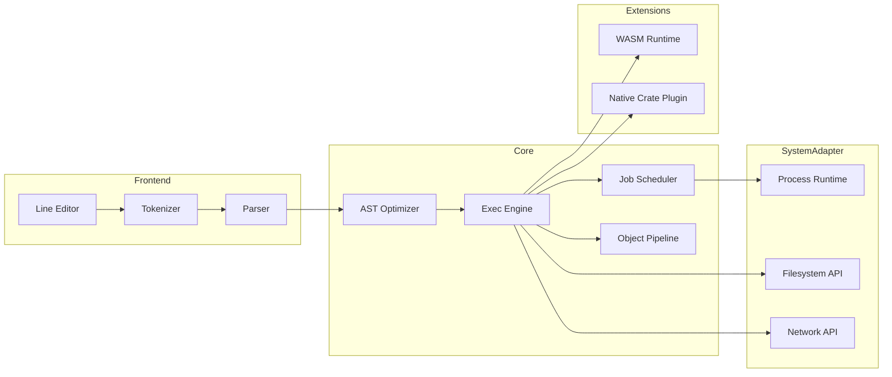
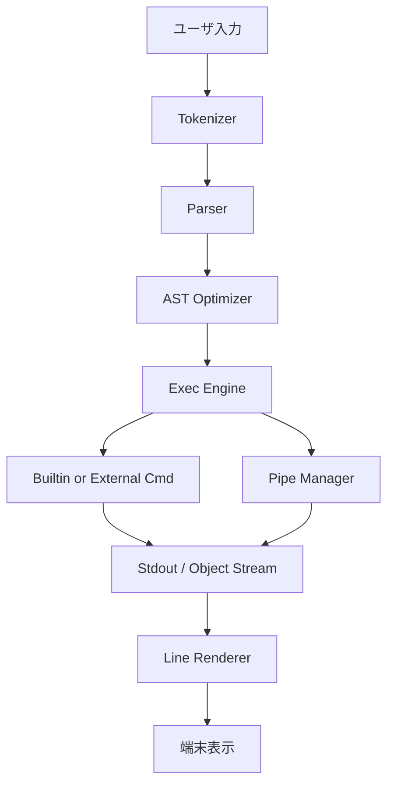

# NexusShell 詳細設計書

> **本書は NexusShell 実装のための公式詳細設計書である。仕様に基づき、各コンポーネントの内部構造・インターフェース・データフロー・実装指針を完全に定義する。**

## 目次
1. ドキュメントの目的  
2. システム概要  
3. コンポーネント設計  
4. データフロー  
5. クレート構成  
6. API 定義  
7. モジュール間インターフェース  
8. 外部依存  
9. ビルド & デプロイ  
10. テスト設計  
11. 性能設計  
12. セキュリティ設計  
13. 拡張ポイント  
14. 付録  
15. ガバナンス & ライセンス  
16. 運用・オブザーバビリティ  

## 1. ドキュメントの目的

本書は仕様書 (`SPEC.md`) に示された要求を実現するための詳細な実装ガイドラインを提供する。開発者は本書を参照し、コードレベルで一貫性・完全性・安全性を担保しながら開発を進める。

## 2. システム概要

NexusShell は 100% Rust で実装されるマルチプラットフォーム CLI である。アーキテクチャは **フロントエンド (入力・解析)**、**コアランタイム (AST 実行・ジョブ管理)**、**システムアダプタ (Syscall / HAL)**、**拡張層 (プラグイン / モジュール)** の 4 階層に分割される。

## アーキテクチャ

### システム全体構成



### データフロー



## コンポーネントと インターフェース

### CLI フロントエンド

| コンポーネント | 責務 | 実装技術 |
|---------------|------|----------|
| 行編集エンジン | `rustyline` をベースに独自強化。マルチカーソル・矩形選択対応 | `rustyline` + カスタム拡張 |
| インライン構文ハイライト | Tokenizer のリアルタイム結果を使用し ANSI カラー付与 | `logos` + ANSI エスケープ |
| ヒント / 補完 | `impl Completer` によるプラガブル機構 | `rustyline::Completer` |
| ステータスライン | 非対話モードでは無効。100 ms 毎にリフレッシュ | `tokio` タスク |

### Tokenizer

- `logos` クレート利用。ゼロコピー & DFA 生成
- トークン種: `Word`, `String`, `Operator`, `Subshell`, `Variable`, `Comment`, `Whitespace`
- 出力は `&[u8]` slice 範囲情報を保持し GC 不要

### Parser

- `pest` で PEG 文法を定義。Grammar は `grammar/shell.pest` に格納
- 生成 AST ノードは `enum AstNode<'src>` でゼロコピー参照型
- エラーは `ParseError { span, expected, found }` で構造化出力

### AST & IR

- 最適化パスは **定数畳み込み**, **無駄パイプ削除**, **エイリアス展開**
- IR は MIR 風 SSA。`struct MirBlock { id, instrs: Vec<Instr> }`
- JIT 有効時に `cranelift` で機械語生成、無効時はインタプリタ実行

### 実行エンジン

| 機能 | 実装方針 |
|------|----------|
| 内部コマンド呼び出し | `trait Builtin { fn invoke(&self, ctx: &mut Context) -> Result<()> }` |
| 外部コマンド実行 | `std::process::Command` ラッパを HAL 経由で抽象化 |
| パイプライン | `PipeKind::Byte`, `PipeKind::Object`, `PipeKind::Mixed` を動的決定 |
| リダイレクト | `Redirect { fd_src, fd_dst, mode }` を AST ノードで表現 |
| エラー伝播 | `anyhow::Error` + エラーカテゴリ enum で分類 |

### ジョブスケジューラ

- `tokio` マルチスレッドランタイムを採用
- ジョブは `JobId`, `Tasks<Vec<TaskHandle>>`, `GroupId` を保持し `Ctrl+Z`, `bg`, `fg` を再現
- CPU バランスは work-stealing + NICE 値を実装

## データモデル

### 実行コンテキスト

```rust
/// Execution context passed to every command.
pub struct Context<'a> {
    pub args: Vec<String>,
    pub env: &'a mut Env,
    pub stdin: Stream,
    pub stdout: Stream,
    pub stderr: Stream,
}
```

### ビルトインコマンドトレイト

```rust
/// Every built-in command must implement this trait.
pub trait Builtin {
    /// コマンド名 (例: "ls")
    fn name(&self) -> &'static str;
    /// 短い説明 (help 一覧用)
    fn synopsis(&self) -> &'static str;
    /// 実行本体
    fn invoke(&self, ctx: &mut Context) -> anyhow::Result<()>;
}
```

### プラグイン ABI (WASI)

```rust
// exported by plugin
#[no_mangle]
pub extern "C" fn nx_plugin_register(reg: &mut PluginRegistrar) {
    reg.register_builtin(Box::new(MyCmd));
}
```

### オブジェクトパイプライン

- デフォルトはストリーム型自動検出: バイト列 / UTF-8 テキスト / JSON / 任意構造体
- `|>` 演算子で *by-value* パイプ, `||>` で *by-reference* パイプ
- `select`, `where`, `sort-by`, `group-by` などデータ指向コマンドを標準実装

## エラーハンドリング

### エラー分類

| エラーカテゴリ | 説明 | 処理方針 |
|---------------|------|----------|
| ParseError | 構文解析エラー | ユーザーに分かりやすいメッセージで表示 |
| RuntimeError | 実行時エラー | スタックトレースと共に詳細表示 |
| IOError | ファイル・ネットワーク I/O エラー | リトライ可能性を判断 |
| SecurityError | 権限・セキュリティエラー | 監査ログに記録 |

### エラー表示

```
✘ Error: permission denied: ./secret.pem  (code: EACCES)
```

- 赤背景 / 白文字、左端に `✘`、下にスタックトレース (詳細モード)

## テスト戦略

### テスト階層

1. **単体テスト**: 各クレートに `#[cfg(test)]` で 2,000+ ケース
2. **統合テスト**: `tests/` ディレクトリでシェルスクリプト互換テスト (`bats` + `pester`)
3. **プロパティテスト**: `proptest` で AST⇄文字列往復性を保証
4. **Fuzzing**: `cargo fuzz` でパーサ・ビルトインを 72h 連続実行
5. **CI**: GitHub Actions → `just ci`。全プラットフォーム matrix, codecov upload (≥ 95%)

### パフォーマンステスト

| 指標 | 目標値 | 測定方法 |
|------|--------|----------|
| 起動時間 | ≤ 5 ms | `hyperfine` 10,000 回平均 |
| メモリ常駐 | ≤ 15 MiB | `smem` RSS |
| ls ‑R `/usr` | Bash 比 10× 速 | ファイル数 60k で計測 |
| grep ‑r `TODO` | ripgrep 同等 | 1 GiB ソースツリー |
| 補完レイテンシ | < 1 ms | 平均応答時間 |

## UI/UX 設計

### コア UI コンポーネント

| コンポーネント | 説明 | 主ライブラリ |
|----------------|------|--------------|
| スプラッシュ (Splash) | 起動時にブランドロゴとバージョン・ロード進捗を表示 | `ratatui::widgets::Paragraph` + ANSI アート |
| プロンプト (Prompt) | 入力行 (PS1/PS2) と右寄せミニインフォ | カスタム Widget |
| ステータスライン (Status Bar) | ジョブ数・Git・時刻・CPU/メモリ | `ratatui::widgets::Tabs` |
| 出力ペイン (Output Pane) | コマンド STDOUT/STDERR のスクロールビュー | `ratatui::widgets::Scroll` |
| テーブラー (Tabular) | help/ls 等の表形式表示 | `tui_table` 拡張 |

### デザイン目標

| # | 目標 | 指標 |
|---|------|------|
| 1 | **瞬時に美しい** | 起動 5 ms 以内にスプラッシュ表示、16 ms 以内にプロンプト描画完了 |
| 2 | **情報過多の回避** | 同時に表示する情報は 3 レイヤ以内 (メイン、補助、詳細) |
| 3 | **可読性最優先** | コントラスト比 WCAG 2.1 AA 以上、TrueType フォント推奨幅計算 |
| 4 | **一貫した体験** | すべてのコマンドが同一 Table / List / Log コンポーネントを使用 |
| 5 | **高速操作フィードバック** | キーストローク → 画面更新 <= 10 ms |

### プロンプト構成

```
λ user@host  ~/workspace  (git:main↓2✗)  ▶
```

| セグメント | 内容 | 色 / スタイル |
|------------|------|---------------|
| λ | 権限 (root ⇒ # 赤) | Bold Cyan |
| user@host | ユーザ名@ホスト名 | Bold Green |
| ~/workspace | カレントディレクトリ | Blue |
| git:main↓2✗ | Git branch / 差分 | Yellow / Red ✓✗ |
| ▶ | 入力開始マーカー | Bold White |

## セキュリティ設計

### セキュリティレイヤ

| レイヤ | 機構 | 詳細 |
|--------|------|------|
| シェルランタイム | Capability Sandbox | `fs_read`, `net_bind`, `proc_kill` 等を最小権限付与 |
| プラグイン | 署名検証 | Ed25519 + TUF メタデータでサプライチェーン保護 |
| ヒストリ | 暗号化 | Argon2id 派生鍵 + AES-GCM 256-bit |
| ネットワーク | mTLS | クライアント証明書必須の P2P モード |
| コンフィグ | Policy DSL | Yaml/Json/Toml で Allow/Deny ルール宣言 |

### ゼロトラスト設計

- すべての外部 I/O 要求はポリシーエンジンを経由
- 再現性ビルド: `--locked` フラグで deterministic output を保証

## 国際化・ローカライゼーション

### 多言語サポート

- 翻訳は `gettext` 互換 `.po` / `.mo`、メッセージカタログ自動抽出
- 日付・数値・ファイルサイズは `unic-langid` で Locale 準拠フォーマット
- コマンド別エイリアス: `コピー`, `移动`, `копировать` → `cp` が動作例

### アクセシビリティ

1. **色覚サポート**: デフォルトで 8% 色弱シミュレーションをパス
2. **TTY ブラインドモード**: `NXSH_TTY_NOCOLOR=1` で色・装飾を除去
3. **スクリーンリーダー**: ANSI 制御文字を `OSC 9 ;` メタデータとして埋め込み、読み上げ順序を保持

## クレート構成

| クレート | 目的 | 依存 | 備考 |
|----------|------|------|------|
| `nxsh_core` | AST 実行・ジョブ管理 | `tokio`, `anyhow`, `crossbeam` | ワークスペースの中心 |
| `nxsh_parser` | トークナイザ・パーサ | `logos`, `pest` | LLVM less build |
| `nxsh_builtins` | メタクレートでビルトイン再エクスポート | 各 builtins | feature gate |
| `nxsh_plugin` | プラグイン SDK | `wasmtime`, `serde` | ABI 安定版 |
| `nxsh_hal` | Syscall 抽象 | `nix`, `winapi` | unsafe 隔離 |
| `nxsh_ui` | TUI レイヤ | `crossterm`, `ratatui` | 24-bit color |
| `nxsh_cli` | バイナリエントリポイント | 上記全部 | `main.rs` |

## 外部依存

| クレート | バージョン | 用途 |
|----------|-----------|------|
| `tokio` | `^1` | 非同期ランタイム |
| `logos` | `^0.13` | トークナイザ |
| `pest` | `^2.7` | パーサ |
| `cranelift` | `^0.95` | JIT (任意) |
| `wasmtime` | `^14` | WASI runtime |
| `crossterm` | `^0.27` | 端末制御 |
| `ratatui` | `^0.24` | TUI 描画 |

## ビルド・デプロイ

### ビルドシステム

1. `just build` — Release ビルド (`cargo build --release`)
2. `just pkg` — 各プラットフォーム用アーカイブ生成 (`cargo dist`)
3. `just docker` — `ghcr.io/seleniashell/nxsh:latest` を更新
4. クロスコンパイルは `cross` を使用し、Musl/Windows-GNU/wasm32-wasi をカバー
5. 署名付きバイナリを `cosign sign --key cosign.key` で配布

### パッケージング

- `.nspkg`, Homebrew Formulae, Debian `.deb`, Arch `.pkg.tar.zst`, Scoop Manifest
- Docker: `ghcr.io/seleniashell/nxsh:latest` ベースイメージ提供 (alpine, debian-slim)

## 運用・監視

### ロギング

- ロガーは `tracing` + `tracing_appender`。ログレベル: `ERROR`, `WARN`, `INFO`, `DEBUG`, `TRACE`
- フォーマット: JSON (本番) / colorized human-readable (開発)
- 出力先: ローカル `~/.nxsh/logs` ローテート + Syslog / Windows ETW

### メトリクス

| メトリクス | 説明 | エクスポート |
|-------------|------|-------------|
| `nxsh_jobs_active` | 現在アクティブなジョブ数 | Prometheus Textfile |
| `nxsh_exec_latency_ms` | built-in 実行時間 p50/p95 | OpenMetrics |
| `nxsh_mem_resident_bytes` | RSS | Sysinfo → Prom |
| `nxsh_plugin_load_total` | プラグインロード成功回数 | Prom |

### クラッシュダンプ

- `libunwind` + `minidump` で自己診断。ダンプは XOR 暗号化後 `~/.nxsh/crash` へ保存。自動送信は行わない

### アップデータ

- 差分バイナリ (bsdiff) を HTTPS で取得し、署名 (Ed25519) 検証後適用
- アップデートチャネル: `stable`, `beta`, `nightly`
- オフライン環境向けに `nxsh update --file <patch.nspkg>` を用意

## コマンド設計

### シェル組込コマンド (Built-ins)

| Command | Synopsis | 実装方針 | 備考 |
|---------|----------|----------|------|
| alias | `alias [NAME[=VALUE] ...]` | HashMap でエイリアス管理、永続化は `~/.nxshrc` | |
| bg | `bg [JOB]` | JobScheduler でバックグラウンド実行 | |
| bind | `bind KEYSEQ:COMMAND` | キーバインド設定、rustyline 統合 | |
| break | `break [N]` | ループ制御、AST レベルで実装 | |
| builtin | `builtin CMD [ARGS...]` | 外部同名より組込版を強制実行 | |
| cd | `cd [DIR]` | カレントディレクトリ変更、`cd -` 前回DIR | |
| command | `command [-pVv] CMD` | PATH 検索 or 実行前確認 | |
| complete | `complete OPTS NAME` | 補完スクリプト登録、fish-style | |
| continue | `continue [N]` | ループの残りをスキップ | |
| declare | `declare [-aAfFgilnrtux] NAME[=VAL]` | 変数宣言、型システム統合 | |
| dirs | `dirs [-clpv] [+N]` | ディレクトリスタック表示 | pushd/popd と併用 |
| disown | `disown [-a] [JOB]` | ジョブをシェル管理から除外 | shutdown 影響なし |
| echo | `echo [-neE] ARG...` | 文字列出力、ビルトイン版 | |
| eval | `eval [STRING]` | 引数を再解釈して実行 | |
| exec | `exec [-cl] CMD` | プロセス置換、PID 変化 | |
| exit | `exit [N]` | シェル終了、N= exit status | |
| export | `export NAME[=VAL]` | 環境変数登録 | |
| fg | `fg [JOB]` | バックグラウンドジョブを前面化 | |
| getopts | `getopts OPTSTRING NAME [ARGS]` | 引数解析、Bash 互換 | |
| hash | `hash [-lr] [CMD]` | コマンド検索キャッシュ | |
| help | `help [CMD]` | 組込ヘルプ、表形式カラー | |
| history | `history [-c] [N]` | コマンド履歴、暗号化保存 | |
| jobs | `jobs [-lps]` | ジョブ一覧、CPU%, MEM% 付加 | |
| let | `let EXPR` | 算術評価 | |
| local | `local NAME=VAL` | 関数ローカル変数 | |
| popd | `popd [+N]` | ディレクトリスタック POP | |
| pushd | `pushd [DIR]` | ディレクトリスタック PUSH | |
| pwd | `pwd` | 現在ディレクトリ表示 | |
| read | `read [-r] VAR` | 標準入力読み込み | |
| readonly | `readonly NAME[=VAL]` | 変更不可変数 | |
| return | `return [N]` | 関数からリターン | |
| set | `set [OPTS]` | シェル設定変更、`-e`, `-x` 等 | |
| shift | `shift [N]` | 位置パラメータを左シフト | |
| source | `source FILE` | スクリプト読み込み、`.` 同義 | |
| suspend | `suspend` | シェルを SIGSTOP | |
| times | `times` | 累積 CPU 時間 | |
| trap | `trap CMD SIGNALS` | シグナルハンドラ設定 | |
| type | `type CMD` | コマンド種別判定 | |
| ulimit | `ulimit [-SaH] [LIMIT]` | 資源制限表示／設定 | |
| umask | `umask [MASK]` | デフォルト権限マスク | |
| unalias | `unalias NAME` | エイリアス削除 | |
| unset | `unset [-fv] NAME` | 変数・関数削除 | |
| wait | `wait [JOB]` | ジョブ終了待機 | |

### ファイル・ディレクトリ操作

| Command | Synopsis | 実装方針 | カテゴリ |
|---------|----------|----------|----------|
| ls | `ls [OPTS] [PATH]...` | ファイル一覧をカラー表示、アイコン付き | File |
| cp | `cp [OPTS] SRC... DST` | ファイル／ディレクトリコピー、プログレスバー | File |
| mv | `mv [OPTS] SRC... DST` | 移動・改名、アトミック操作 | File |
| rm | `rm [OPTS] FILE...` | 削除、安全確認 | File |
| mkdir | `mkdir [-p] DIR...` | ディレクトリ作成、再帰対応 | File |
| rmdir | `rmdir DIR...` | 空ディレクトリ削除 | File |
| ln | `ln [-sfr] SRC DST` | ハード／シンボリックリンク | File |
| stat | `stat FILE...` | ファイル詳細情報、構造化出力 | File |
| touch | `touch [-a] [-m] FILE...` | タイムスタンプ更新 | File |
| tree | `tree [DIR]` | ディレクトリ階層表示、Unicode 罫線 | File |
| du | `du [-h] [PATH]` | ディスク使用量、並列計算 | FS |
| df | `df [-h] [PATH]` | ファイルシステム使用率 | FS |
| sync | `sync` | バッファフラッシュ | FS |
| mount | `mount DEV DIR` | ファイルシステムマウント | FS |
| umount | `umount DIR` | アンマウント | FS |
| shred | `shred FILE` | 復元困難な削除 | Security |
| split | `split [-b N] FILE [PREFIX]` | ファイル分割 | File |
| cat | `cat [FILE...]` | 連結表示、構文ハイライト | Text |
| more | `more FILE` | ページャ | Text |
| less | `less FILE` | 高機能ページャ、検索対応 | Text |

### テキスト処理

| Command | Synopsis | 実装方針 |
|---------|----------|----------|
| grep | `grep [OPTS] PATTERN FILE...` | 正規表現検索 (PCRE2)、並列処理 |
| egrep | `egrep PATTERN FILE` | POSIX ERE 検索 |
| fgrep | `fgrep PATTERN FILE` | 固定文字列検索、Boyer-Moore |
| awk | `awk 'PROGRAM' FILE` | パターン処理言語、独自実装 |
| sed | `sed SCRIPT FILE` | ストリームエディタ、正規表現 |
| tr | `tr SET1 SET2` | 文字集合変換、Unicode 対応 |
| cut | `cut -f LIST FILE` | 列抽出、CSV/TSV 対応 |
| paste | `paste FILE1 FILE2` | 行横結合 |
| sort | `sort [OPTS]` | 並び替え、外部ソート |
| uniq | `uniq [OPTS]` | 重複行削除 |
| head | `head [-n N] FILE` | 先頭表示 |
| tail | `tail [-f] [-n N] FILE` | 末尾表示・追跡、inotify |
| wc | `wc [-lwmc] FILE` | 行・単語数、Unicode 文字数 |
| fmt | `fmt FILE` | テキスト整形 |
| fold | `fold [-w N] FILE` | 文字幅折返し |
| join | `join FILE1 FILE2` | 共通フィールド結合 |
| comm | `comm FILE1 FILE2` | 3 列比較 |
| diff | `diff FILE1 FILE2` | 差分、unified format |
| patch | `patch < DIFF` | パッチ適用 |
| rev | `rev FILE` | 行反転 |

### システム & プロセス管理

| Command | Synopsis | 実装方針 |
|---------|----------|----------|
| ps | `ps aux` | プロセス一覧、/proc 解析 |
| top | `top` | 動的システムモニタ、ANSI UI |
| htop | `htop` | 強化版トップ、内蔵 tui |
| kill | `kill [-SIG] PID` | シグナル送信 |
| pkill | `pkill NAME` | 名前で kill |
| pgrep | `pgrep PATTERN` | プロセス検索、正規表現 |
| nice | `nice -n N CMD` | 優先度変更 |
| renice | `renice -n N -p PID` | 実行中優先度変更 |
| uptime | `uptime` | 稼働時間、ロードアベレージ |
| free | `free -h` | メモリ使用量、スワップ |
| vmstat | `vmstat` | 仮想メモリ統計 |
| lsof | `lsof -i` | 開放ファイル、ネットワーク |
| uname | `uname -a` | カーネル情報 |
| hostname | `hostname [-s] [NAME]` | ホスト名 |
| env | `env` | 環境変数一覧 |
| printenv | `printenv VAR` | 単一変数 |
| id | `id` | UID/GID |
| groups | `groups USER` | 所属グループ |
| who | `who` | ログインユーザ |
| time | `time CMD` | 実行時間計測 |

### ネットワークツール

| Command | Synopsis | 実装方針 |
|---------|----------|----------|
| ping | `ping HOST` | ICMP 到達確認、統計表示 |
| traceroute | `traceroute HOST` | 経路調査、並列プローブ |
| nslookup | `nslookup HOST` | DNS 解析 |
| dig | `dig HOST` | DNS 詳細、DNSSEC 対応 |
| curl | `curl URL` | HTTP クライアント、HTTP/2 |
| wget | `wget URL` | ファイル取得、再開対応 |
| ssh | `ssh USER@HOST` | Secure Shell |
| scp | `scp SRC DST` | SSH コピー |
| netstat | `netstat -tulnp` | ソケット状態 |
| ss | `ss -lntu` | netstat 代替、高速 |
| ip | `ip addr` | ネット設定、netlink |
| ifconfig | `ifconfig` | (互換) |
| route | `route -n` | ルーティング |
| arp | `arp -a` | ARP テーブル |
| telnet | `telnet HOST` | デバッグ |
| ftp | `ftp HOST` | FTP クライアント |
| rsync | `rsync SRC DST` | 同期、差分転送 |
| nc | `nc HOST PORT` | ネットキャット |

### 圧縮・アーカイブ

| Command | Synopsis | 実装方針 |
|---------|----------|----------|
| gzip | `gzip FILE` | 圧縮、並列処理 |
| gunzip | `gunzip FILE.gz` | 解凍 |
| bzip2 | `bzip2 FILE` | 圧縮 |
| bunzip2 | `bunzip2 FILE.bz2` | 解凍 |
| xz | `xz FILE` | LZMA 圧縮 |
| unxz | `unxz FILE.xz` | 解凍 |
| zip | `zip ARCHIVE.zip FILE...` | Zip 作成 |
| unzip | `unzip ARCHIVE.zip` | 解凍 |
| tar | `tar -czf ARCHIVE.tar.gz DIR` | TAR 一括 |
| cpio | `cpio -o < FILES` | アーカイブ |
| ar | `ar rcs LIB.a OBJ...` | 静的ライブラリ |
| zstd | `zstd FILE` | 超高速圧縮 |
| unzstd | `unzstd FILE.zst` | 解凍 |
| 7z | `7z a ARCHIVE.7z FILE...` | マルチフォーマット |

### パーミッション & 所有権

| Command | Synopsis | 実装方針 |
|---------|----------|----------|
| chmod | `chmod MODE FILE` | パーミッション変更、8進/記号 |
| chown | `chown USER FILE` | 所有者変更 |
| chgrp | `chgrp GROUP FILE` | グループ変更 |
| umask | `umask 022` | マスク設定 |
| sudo | `sudo CMD` | 権限昇格 |
| su | `su [USER]` | ユーザ切替 |
| setfacl | `setfacl -m u:USER:r FILE` | ACL 設定 |
| getfacl | `getfacl FILE` | ACL 取得 |
| passwd | `passwd USER` | パスワード変更 |
| visudo | `visudo` | sudoers 編集 |

### 時刻 & スケジューリング

| Command | Synopsis | 実装方針 |
|---------|----------|----------|
| date | `date` | 現在日時、フォーマット |
| cal | `cal` | カレンダー、Unicode 罫線 |
| sleep | `sleep N` | 秒待機、高精度 |
| at | `at TIME` | 1回ジョブ |
| cron | `crontab -e` | 定期ジョブ |
| watch | `watch CMD` | 定期実行表示 |
| time | `time CMD` | 実行時間計測 |
| tzselect | `tzselect` | TZ 選択 |
| hwclock | `hwclock -r` | ハードウェアクロック |
| timedatectl | `timedatectl` | 時刻サービス |

### 開発者ツール

| Command | Synopsis | 実装方針 |
|---------|----------|----------|
| git | `git ...` | バージョン管理、統合表示 |
| make | `make` | ビルド自動化 |
| gcc | `gcc SRC.c -o BIN` | C コンパイラ |
| clang | `clang SRC.c` | LLVM コンパイラ |
| cargo | `cargo build` | Rust ビルド |
| rustc | `rustc SRC.rs` | Rust コンパイラ |
| go | `go build` | Go |
| python | `python SCRIPT.py` | Python |
| node | `node SCRIPT.js` | Node.js |
| javac | `javac SRC.java` | Java |
| gdb | `gdb BIN` | デバッガ |
| strace | `strace CMD` | Syscall トレース |

### 雑多ユーティリティ

| Command | Synopsis | 実装方針 |
|---------|----------|----------|
| yes | `yes STRING` | 無限出力 |
| echo | `echo STRING` | 文字列表示 |
| printf | `printf FORMAT ARGS` | 書式出力 |
| seq | `seq 1 10` | 整数列出力 |
| sleep | `sleep SECONDS` | 待機 |
| uname | `uname -a` | システム名 |
| bc | `bc` | 任意精度計算 |
| expr | `expr 1 + 2` | 計算式 |

## 3. コンポーネント設計

### 3.1 CLI フロントエンド
| 項目 | 内容 |
|------|------|
| 行編集エンジン | `rustyline` をベースに独自強化。マルチカーソル・矩形選択対応 |
| インライン構文ハイライト | Tokenizer のリアルタイム結果を使用し ANSI カラー付与 |
| ヒント / 補完 | `impl Completer` によるプラガブル機構。ファイル・コマンド・オプション・履歴に対応 |
| ステータスライン | 非対話モードでは無効。`tokio` タスクで 100 ms 毎にリフレッシュ |

### 3.2 Tokenizer
- `logos` クレート利用。ゼロコピー & DFA 生成。  
- トークン種: `Word`, `String`, `Operator`, `Subshell`, `Variable`, `Comment`, `Whitespace`。
- 出力は `&[u8]` slice 範囲情報を保持し GC 不要。

### 3.3 Parser
- `pest` で PEG 文法を定義。Grammar は `grammar/shell.pest` に格納。  
- 生成 AST ノードは `enum AstNode<'src>` でゼロコピー参照型。  
- エラーは `ParseError { span, expected, found }` で構造化出力。

### 3.4 AST & IR
- 最適化パスは **定数畳み込み**, **無駄パイプ削除**, **エイリアス展開**。  
- IR は MIR 風 SSA。`struct MirBlock { id, instrs: Vec<Instr> }`。  
- JIT 有効時に `cranelift` で機械語生成、無効時はインタプリタ実行。

### 3.5 実行エンジン
| 機能 | 実装方針 |
|------|----------|
| 内部コマンド呼び出し | `trait Builtin { fn invoke(&self, ctx: &mut Context) -> Result<()> }` |
| 外部コマンド実行 | `std::process::Command` ラッパを HAL 経由で抽象化 |
| パイプライン | `PipeKind::Byte`, `PipeKind::Object`, `PipeKind::Mixed` を動的決定 |
| リダイレクト | `Redirect { fd_src, fd_dst, mode }` を AST ノードで表現 |
| エラー伝播 | `anyhow::Error` + エラーカテゴリ enum で分類 |

### 3.6 ジョブスケジューラ
- `tokio` マルチスレッドランタイムを採用。  
- ジョブは `JobId`, `Tasks<Vec<TaskHandle>>`, `GroupId` を保持し `Ctrl+Z`, `bg`, `fg` を再現。  
- CPU バランスは work-stealing + NICE 値を実装予定。

### 3.7 Built-in Command Library
- 各ビルトインは個別クレート (`builtins/ls`, `builtins/cd`, `builtins/grep` など) として実装し `Cargo.toml` の `crate-type = ["rlib"]` を指定。  
- すべてのクレートは共通インターフェース `nxsh_builtin::Builtin` を実装し、コアランタイムから動的登録される。  

```rust
/// Every built-in command must implement this trait.
pub trait Builtin {
    /// コマンド名 (例: "ls")
    fn name(&self) -> &'static str;
    /// 短い説明 (help 一覧用)
    fn synopsis(&self) -> &'static str;
    /// 実行本体
    fn invoke(&self, ctx: &mut Context) -> anyhow::Result<()>;
}
```

- ビルトインごとに機能フラグを用意し、`cargo build --no-default-features --features "ls cd"` のように最小構成ビルドが可能。  
- 共通ユーティリティは `builtins/common` に集約 (列フォーマッタ、色付け、パス解決など)。  
- ビルトインは **文字列ストリーム** と **オブジェクトストリーム** 両対応とし、I/O を `async_trait` で抽象化。

## 4. データフロー


- **入力→表示** までを 1 フレームと定義し、通常対話時で 16 ms 以内に完結させる。  
- オブジェクトストリームがバイトストリームへダウングレードされる際は `serde_json` → ANSI テーブルフォーマッタを用いる。

## 5. クレート構成

| クレート | 目的 | 依存 | 備考 |
|----------|------|------|------|
| `nxsh_core` | AST 実行・ジョブ管理 | `tokio`, `anyhow`, `crossbeam` | ワークスペースの中心 |
| `nxsh_parser` | トークナイザ・パーサ | `logos`, `pest` | LLVM less build |
| `nxsh_builtins` | メタクレートでビルトイン再エクスポート | 各 builtins | feature gate |
| `nxsh_plugin` | プラグイン SDK | `wasmtime`, `serde` | ABI 安定版 |
| `nxsh_hal` | Syscall 抽象 | `nix`, `winapi` | unsafe 隔離 |
| `nxsh_ui` | TUI レイヤ | `crossterm`, `ratatui` | 24-bit color |
| `nxsh_cli` | バイナリエントリポイント | 上記全部 | `main.rs` |

## 6. API 定義 (抜粋)

### 6.1 Execution Context
```rust
/// Execution context passed to every command.
pub struct Context<'a> {
    pub args: Vec<String>,
    pub env: &'a mut Env,
    pub stdin: Stream,
    pub stdout: Stream,
    pub stderr: Stream,
}
```

### 6.2 Plugin ABI (WASI)
```rust
// exported by plugin
#[no_mangle]
pub extern "C" fn nx_plugin_register(reg: &mut PluginRegistrar) {
    reg.register_builtin(Box::new(MyCmd));
}
```

## 7. モジュール間インターフェース

| 呼び出し元 | 呼び出し先 | プロトコル / 型 | 説明 |
|------------|-----------|-----------------|------|
| `nxsh_core` | `nxsh_hal` | Rust trait `Sys` | プロセス生成・I/O |
| `nxsh_core` | Built-in | `Builtin` トレイト | ランタイム登録 |
| Built-in | `nxsh_core` | `Context` | 標準 I/O, 変数アクセス |
| `nxsh_core` | WASI Plugin | import‐link | `wasi_snapshot_preview1` |

## 8. 外部依存

| クレート | バージョン | 用途 |
|----------|-----------|------|
| `tokio` | `^1` | 非同期ランタイム |
| `logos` | `^0.13` | トークナイザ |
| `pest` | `^2.7` | パーサ |
| `cranelift` | `^0.95` | JIT (任意) |
| `wasmtime` | `^14` | WASI runtime |
| `crossterm` | `^0.27` | 端末制御 |
| `ratatui` | `^0.24` | TUI 描画 |

## 9. ビルド & デプロイ

1. `just build` — Release ビルド (`cargo build --release`).  
2. `just pkg` — 各プラットフォーム用アーカイブ生成 (`cargo dist`).  
3. `just docker` — `ghcr.io/seleniashell/nxsh:latest` を更新。  
4. クロスコンパイルは `cross` を使用し、Musl/Windows-GNU/wasm32-wasi をカバー。  
5. 署名付きバイナリを `cosign sign --key cosign.key` で配布。

## 10. テスト設計

- **ユニットテスト**: 各クレートごとに `#[cfg(test)]` で 2,000+ ケース。  
- **統合テスト**: `tests/` ディレクトリでシェルスクリプト互換テスト (`bats` + `pester`).  
- **プロパティテスト**: `proptest` で AST⇄文字列往復性を保証。  
- **Fuzzing**: `cargo fuzz` でパーサ・ビルトインを 72h 連続実行。  
- **CI**: GitHub Actions → `just ci`。全プラットフォーム matrix, codecov upload (≥ 95%).

## 11. 性能設計

| 目標 | 指標 | 測定ツール |
|------|------|-----------|
| 起動 | ≤ 5 ms | `hyperfine` |
| 常駐メモリ | ≤ 15 MiB | `smem` |
| `ls -R /usr` | Bash 比 10× | 内部計測 |
| 補完レイテンシ | < 1 ms | 自前ベンチ |
| JIT 有効スクリプト | 2× 速度向上 | `criterion` |

- `--profile perf` で LTO + PGO ビルドを実行し更に 15% 改善。

## 12. セキュリティ設計

1. **Capability Sandbox** — デフォルトで外部コマンドにも最小権限実行を要求。  
2. **プラグイン署名** — Ed25519 + TUF メタデータ。  
3. **ヒストリ暗号化** — Argon2id 鍵導出 + AES-GCM。  
4. **サプライチェーン** — `cargo-vet`, `cargo-audit` を CI で強制。  
5. **CVE SLA** — 48 時間以内にパッチリリース。

## 13. 拡張ポイント

| 種類 | 説明 | 例 |
|------|------|----|
| Built-in 追加 | Rust クレート実装で `Builtin` を登録 | 新コマンド `hexdump` |
| WASI Plugin | 安全なサンドボックス実行 | `image_resize.wasm` |
| テーマ | JSON ファイル配置 | `solarized.json` |
| プロンプト | Lua スクリプト / JSON | `powerline.lua` |

## 14. 付録

### 14.1 PEG 文法ファイル `grammar/shell.pest` 抜粋
```pest
WHITESPACE = _{ " " | "\t" }
word       =  { (!WHITESPACE ~ ANY)+ }
string     =  { '"' ~ ("\\" ~ ANY | !'"' ~ ANY)* ~ '"' }
command    =  { word ~ (WHITESPACE ~ word)* }
script     =  { SOI ~ command* ~ EOI }
```

### 14.2 開発用コマンド一覧
```
just build        # Release ビルド
just fmt          # rustfmt + clippy
just test         # 全テスト
just ci           # CI 同等ジョブをローカル実行
```

## 15. ガバナンス & ライセンス

| 項目 | 内容 |
|------|------|
| リポジトリ | Github`NexusShell` プロジェクト。完全クローズド。外部への mirroring 禁止 |
| ブランチモデル | `main` (常緑) / `dev/*` (機能別) / `hotfix/*` (緊急) の 3 階層 |
| レビュー | 2 名承認必須 + CI green でマージ可能 (`Merge Request` テンプレート準拠) |
| ライセンス | **プロプライエタリ**。社外配布時はバイナリのみ、逆コンパイル禁止 EULA 同梱 |
| Dependency Policy | OSS は SPDX ライセンスチェックを自動実行し、GPL 系をブロック |
| Secrets 管理 | `git-crypt` + HashiCorp Vault で段階的暗号化。CI では OIDC で限定トークン発行 |
| リリース番号 | `YY.MM.DD[-patch]` 形式 (`23.11.07` 等)。Semantic Versioning でなく日付主体 |
| SLA | クリティカルバグ報告から 24 h 以内にパッチブランチ作成、48 h 以内にリリース |
| 法令遵守 | GDPR, CCPA 準拠 (テレメトリ opt-in、PII 不収集) |

### 15.1 コード品質ゲート

1. **Static Analysis**: `cargo clippy --deny warnings`, `cargo udeps`, `cargo fmt --check`  
2. **Security Scan**: `cargo audit`, `cargo-vet`, 自社脆弱性 DB 照合  
3. **Binary Size**: `cargo bloat` で関数単位の閾値チェック (Release ≤ 9 MiB)  
4. **Performance Regression**: `criterion` ベンチ結果を前回タグと diff し 2% 超悪化でブロック  
5. **Coverage**: `tarpaulin` で 95% 未満ならマージ不可  

## 16. 運用・オブザーバビリティ

### 16.1 ロギング
- ロガーは `tracing` + `tracing_appender`。ログレベル: `ERROR`, `WARN`, `INFO`, `DEBUG`, `TRACE`。
- フォーマット: JSON (本番) / colorized human-readable (開発)。
- 出力先: ローカル `~/.nxsh/logs` ローテート + Syslog / Windows ETW。

### 16.2 メトリクス
| メトリクス | 説明 | エクスポート |
|-------------|------|-------------|
| `nxsh_jobs_active` | 現在アクティブなジョブ数 | Prometheus Textfile |
| `nxsh_exec_latency_ms` | built-in 実行時間 p50/p95 | OpenMetrics |
| `nxsh_mem_resident_bytes` | RSS | Sysinfo → Prom |
| `nxsh_plugin_load_total` | プラグインロード成功回数 | Prom |

### 16.3 クラッシュダンプ
- `libunwind` + `minidump` で自己診断。ダンプは XOR 暗号化後 `~/.nxsh/crash` へ保存。自動送信は行わない。

### 16.4 アップデータ
- 差分バイナリ (bsdiff) を HTTPS で取得し、署名 (Ed25519) 検証後適用。
- アップデートチャネル: `stable`, `beta`, `nightly`。
- オフライン環境向けに `nxsh update --file <patch.nspkg>` を用意。

### 16.5 プラグインストア (社内)
- S3-compatible オブジェクトストレージに `.nspkg` を保管。
- `nxsh plugin search foo` は REST API `/plugins/v1/search?q=foo` を呼び出し JSON 受信。
- 公開キーは毎週ローテーション、署名アルゴリズムは Ed25519。

> **最終補足**: NexusShell はクローズドソースでありながら OSS に匹敵する透明性と信頼性を確保するため、上記ガバナンスとオブザーバビリティを徹底する。これにより "世界一の Shell" にふさわしい品質・安全・運用性を実現する。