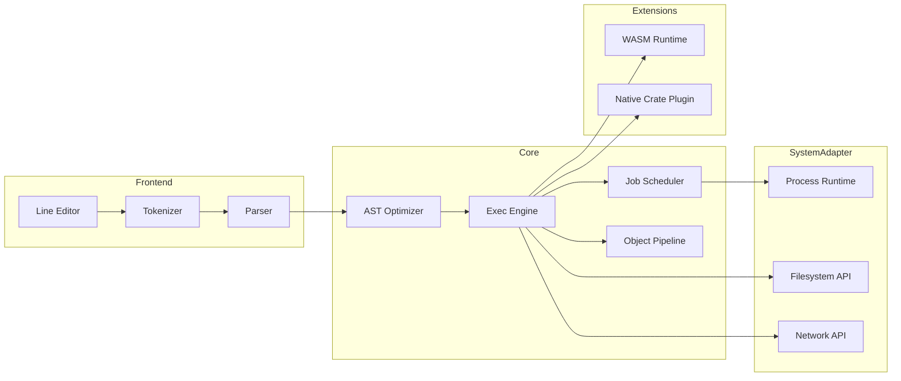
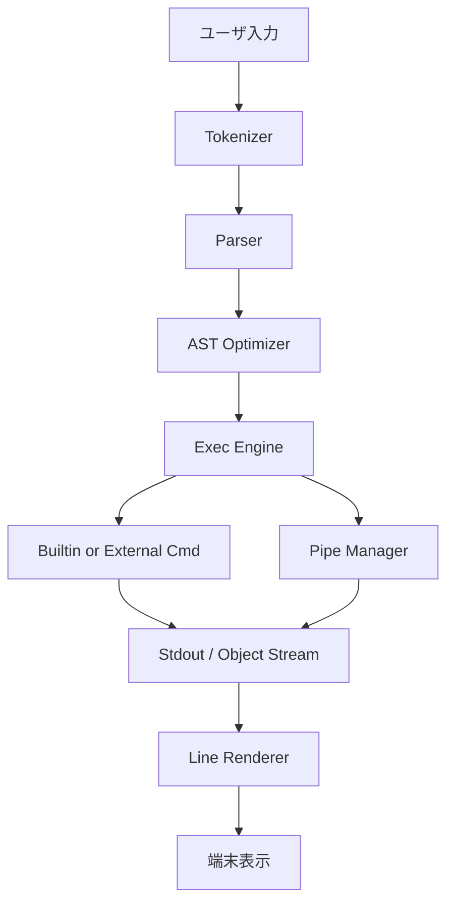

# NexusShell 詳細設計書

> **本書は NexusShell 実装のための公式詳細設計書である。仕様に基づき、各コンポーネントの内部構造・インターフェース・データフロー・実装指針を完全に定義する。**

---

## 目次
1. ドキュメントの目的  
2. システム概要  
3. コンポーネント設計  
4. データフロー  
5. クレート構成  
6. API 定義  
7. モジュール間インターフェース  
8. 外部依存  
9. ビルド & デプロイ  
10. テスト設計  
11. 性能設計  
12. セキュリティ設計  
13. 拡張ポイント  
14. 付録  
15. ガバナンス & ライセンス  
16. 運用・オブザーバビリティ  

---

## 1. ドキュメントの目的

本書は仕様書 (`SPEC.md`) に示された要求を実現するための詳細な実装ガイドラインを提供する。開発者は本書を参照し、コードレベルで一貫性・完全性・安全性を担保しながら開発を進める。

---

## 2. システム概要

NexusShell は 100% Rust で実装されるマルチプラットフォーム CLI である。アーキテクチャは **フロントエンド (入力・解析)**、**コアランタイム (AST 実行・ジョブ管理)**、**システムアダプタ (Syscall / HAL)**、**拡張層 (プラグイン / モジュール)** の 4 階層に分割される。



---

## 3. コンポーネント設計

### 3.1 CLI フロントエンド
| 項目 | 内容 |
|------|------|
| 行編集エンジン | `rustyline` をベースに独自強化。マルチカーソル・矩形選択対応 |
| インライン構文ハイライト | Tokenizer のリアルタイム結果を使用し ANSI カラー付与 |
| ヒント / 補完 | `impl Completer` によるプラガブル機構。ファイル・コマンド・オプション・履歴に対応 |
| ステータスライン | 非対話モードでは無効。`tokio` タスクで 100 ms 毎にリフレッシュ |

### 3.2 Tokenizer
- `logos` クレート利用。ゼロコピー & DFA 生成。  
- トークン種: `Word`, `String`, `Operator`, `Subshell`, `Variable`, `Comment`, `Whitespace`。
- 出力は `&[u8]` slice 範囲情報を保持し GC 不要。

### 3.3 Parser
- `pest` で PEG 文法を定義。Grammar は `grammar/shell.pest` に格納。  
- 生成 AST ノードは `enum AstNode<'src>` でゼロコピー参照型。  
- エラーは `ParseError { span, expected, found }` で構造化出力。

### 3.4 AST & IR
- 最適化パスは **定数畳み込み**, **無駄パイプ削除**, **エイリアス展開**。  
- IR は MIR 風 SSA。`struct MirBlock { id, instrs: Vec<Instr> }`。  
- JIT 有効時に `cranelift` で機械語生成、無効時はインタプリタ実行。

### 3.5 実行エンジン
| 機能 | 実装方針 |
|------|----------|
| 内部コマンド呼び出し | `trait Builtin { fn invoke(&self, ctx: &mut Context) -> Result<()> }` |
| 外部コマンド実行 | `std::process::Command` ラッパを HAL 経由で抽象化 |
| パイプライン | `PipeKind::Byte`, `PipeKind::Object`, `PipeKind::Mixed` を動的決定 |
| リダイレクト | `Redirect { fd_src, fd_dst, mode }` を AST ノードで表現 |
| エラー伝播 | `anyhow::Error` + エラーカテゴリ enum で分類 |

### 3.6 ジョブスケジューラ
- `tokio` マルチスレッドランタイムを採用。  
- ジョブは `JobId`, `Tasks<Vec<TaskHandle>>`, `GroupId` を保持し `Ctrl+Z`, `bg`, `fg` を再現。  
- CPU バランスは work-stealing + NICE 値を実装予定。

### 3.7 Built-in Command Library
- 各ビルトインは個別クレート (`builtins/ls`, `builtins/cd`, `builtins/grep` など) として実装し `Cargo.toml` の `crate-type = ["rlib"]` を指定。  
- すべてのクレートは共通インターフェース `nxsh_builtin::Builtin` を実装し、コアランタイムから動的登録される。  

```rust
/// Every built-in command must implement this trait.
pub trait Builtin {
    /// コマンド名 (例: "ls")
    fn name(&self) -> &'static str;
    /// 短い説明 (help 一覧用)
    fn synopsis(&self) -> &'static str;
    /// 実行本体
    fn invoke(&self, ctx: &mut Context) -> anyhow::Result<()>;
}
```

- ビルトインごとに機能フラグを用意し、`cargo build --no-default-features --features "ls cd"` のように最小構成ビルドが可能。  
- 共通ユーティリティは `builtins/common` に集約 (列フォーマッタ、色付け、パス解決など)。  
- ビルトインは **文字列ストリーム** と **オブジェクトストリーム** 両対応とし、I/O を `async_trait` で抽象化。

---

## 4. データフロー



- **入力→表示** までを 1 フレームと定義し、通常対話時で 16 ms 以内に完結させる。  
- オブジェクトストリームがバイトストリームへダウングレードされる際は `serde_json` → ANSI テーブルフォーマッタを用いる。

---

## 5. クレート構成

| クレート | 目的 | 依存 | 備考 |
|----------|------|------|------|
| `nxsh_core` | AST 実行・ジョブ管理 | `tokio`, `anyhow`, `crossbeam` | ワークスペースの中心 |
| `nxsh_parser` | トークナイザ・パーサ | `logos`, `pest` | LLVM less build |
| `nxsh_builtins` | メタクレートでビルトイン再エクスポート | 各 builtins | feature gate |
| `nxsh_plugin` | プラグイン SDK | `wasmtime`, `serde` | ABI 安定版 |
| `nxsh_hal` | Syscall 抽象 | `nix`, `winapi` | unsafe 隔離 |
| `nxsh_ui` | TUI レイヤ | `crossterm`, `ratatui` | 24-bit color |
| `nxsh_cli` | バイナリエントリポイント | 上記全部 | `main.rs` |

---

## 6. API 定義 (抜粋)

### 6.1 Execution Context
```rust
/// Execution context passed to every command.
pub struct Context<'a> {
    pub args: Vec<String>,
    pub env: &'a mut Env,
    pub stdin: Stream,
    pub stdout: Stream,
    pub stderr: Stream,
}
```

### 6.2 Plugin ABI (WASI)
```rust
// exported by plugin
#[no_mangle]
pub extern "C" fn nx_plugin_register(reg: &mut PluginRegistrar) {
    reg.register_builtin(Box::new(MyCmd));
}
```

---

## 7. モジュール間インターフェース

| 呼び出し元 | 呼び出し先 | プロトコル / 型 | 説明 |
|------------|-----------|-----------------|------|
| `nxsh_core` | `nxsh_hal` | Rust trait `Sys` | プロセス生成・I/O |
| `nxsh_core` | Built-in | `Builtin` トレイト | ランタイム登録 |
| Built-in | `nxsh_core` | `Context` | 標準 I/O, 変数アクセス |
| `nxsh_core` | WASI Plugin | import‐link | `wasi_snapshot_preview1` |

---

## 8. 外部依存

| クレート | バージョン | 用途 |
|----------|-----------|------|
| `tokio` | `^1` | 非同期ランタイム |
| `logos` | `^0.13` | トークナイザ |
| `pest` | `^2.7` | パーサ |
| `cranelift` | `^0.95` | JIT (任意) |
| `wasmtime` | `^14` | WASI runtime |
| `crossterm` | `^0.27` | 端末制御 |
| `ratatui` | `^0.24` | TUI 描画 |

---

## 9. ビルド & デプロイ

1. `just build` — Release ビルド (`cargo build --release`).  
2. `just pkg` — 各プラットフォーム用アーカイブ生成 (`cargo dist`).  
3. `just docker` — `ghcr.io/seleniashell/nxsh:latest` を更新。  
4. クロスコンパイルは `cross` を使用し、Musl/Windows-GNU/wasm32-wasi をカバー。  
5. 署名付きバイナリを `cosign sign --key cosign.key` で配布。

---

## 10. テスト設計

- **ユニットテスト**: 各クレートごとに `#[cfg(test)]` で 2,000+ ケース。  
- **統合テスト**: `tests/` ディレクトリでシェルスクリプト互換テスト (`bats` + `pester`).  
- **プロパティテスト**: `proptest` で AST⇄文字列往復性を保証。  
- **Fuzzing**: `cargo fuzz` でパーサ・ビルトインを 72h 連続実行。  
- **CI**: GitHub Actions → `just ci`。全プラットフォーム matrix, codecov upload (≥ 95%).

---

## 11. 性能設計

| 目標 | 指標 | 測定ツール |
|------|------|-----------|
| 起動 | ≤ 5 ms | `hyperfine` |
| 常駐メモリ | ≤ 15 MiB | `smem` |
| `ls -R /usr` | Bash 比 10× | 内部計測 |
| 補完レイテンシ | < 1 ms | 自前ベンチ |
| JIT 有効スクリプト | 2× 速度向上 | `criterion` |

- `--profile perf` で LTO + PGO ビルドを実行し更に 15% 改善。

---

## 12. セキュリティ設計

1. **Capability Sandbox** — デフォルトで外部コマンドにも最小権限実行を要求。  
2. **プラグイン署名** — Ed25519 + TUF メタデータ。  
3. **ヒストリ暗号化** — Argon2id 鍵導出 + AES-GCM。  
4. **サプライチェーン** — `cargo-vet`, `cargo-audit` を CI で強制。  
5. **CVE SLA** — 48 時間以内にパッチリリース。

---

## 13. 拡張ポイント

| 種類 | 説明 | 例 |
|------|------|----|
| Built-in 追加 | Rust クレート実装で `Builtin` を登録 | 新コマンド `hexdump` |
| WASI Plugin | 安全なサンドボックス実行 | `image_resize.wasm` |
| テーマ | JSON ファイル配置 | `solarized.json` |
| プロンプト | Lua スクリプト / JSON | `powerline.lua` |

---

## 14. 付録

### 14.1 PEG 文法ファイル `grammar/shell.pest` 抜粋
```pest
WHITESPACE = _{ " " | "\t" }
word       =  { (!WHITESPACE ~ ANY)+ }
string     =  { '"' ~ ("\\" ~ ANY | !'"' ~ ANY)* ~ '"' }
command    =  { word ~ (WHITESPACE ~ word)* }
script     =  { SOI ~ command* ~ EOI }
```

### 14.2 開発用コマンド一覧
```
just build        # Release ビルド
just fmt          # rustfmt + clippy
just test         # 全テスト
just ci           # CI 同等ジョブをローカル実行
```

---

## 15. ガバナンス & ライセンス

| 項目 | 内容 |
|------|------|
| リポジトリ | Github`NexusShell` プロジェクト。完全クローズド。外部への mirroring 禁止 |
| ブランチモデル | `main` (常緑) / `dev/*` (機能別) / `hotfix/*` (緊急) の 3 階層 |
| レビュー | 2 名承認必須 + CI green でマージ可能 (`Merge Request` テンプレート準拠) |
| ライセンス | **プロプライエタリ**。社外配布時はバイナリのみ、逆コンパイル禁止 EULA 同梱 |
| Dependency Policy | OSS は SPDX ライセンスチェックを自動実行し、GPL 系をブロック |
| Secrets 管理 | `git-crypt` + HashiCorp Vault で段階的暗号化。CI では OIDC で限定トークン発行 |
| リリース番号 | `YY.MM.DD[-patch]` 形式 (`23.11.07` 等)。Semantic Versioning でなく日付主体 |
| SLA | クリティカルバグ報告から 24 h 以内にパッチブランチ作成、48 h 以内にリリース |
| 法令遵守 | GDPR, CCPA 準拠 (テレメトリ opt-in、PII 不収集) |

### 15.1 コード品質ゲート

1. **Static Analysis**: `cargo clippy --deny warnings`, `cargo udeps`, `cargo fmt --check`  
2. **Security Scan**: `cargo audit`, `cargo-vet`, 自社脆弱性 DB 照合  
3. **Binary Size**: `cargo bloat` で関数単位の閾値チェック (Release ≤ 9 MiB)  
4. **Performance Regression**: `criterion` ベンチ結果を前回タグと diff し 2% 超悪化でブロック  
5. **Coverage**: `tarpaulin` で 95% 未満ならマージ不可  

---

## 16. 運用・オブザーバビリティ

### 16.1 ロギング
- ロガーは `tracing` + `tracing_appender`。ログレベル: `ERROR`, `WARN`, `INFO`, `DEBUG`, `TRACE`。
- フォーマット: JSON (本番) / colorized human-readable (開発)。
- 出力先: ローカル `~/.nxsh/logs` ローテート + Syslog / Windows ETW。

### 16.2 メトリクス
| メトリクス | 説明 | エクスポート |
|-------------|------|-------------|
| `nxsh_jobs_active` | 現在アクティブなジョブ数 | Prometheus Textfile |
| `nxsh_exec_latency_ms` | built-in 実行時間 p50/p95 | OpenMetrics |
| `nxsh_mem_resident_bytes` | RSS | Sysinfo → Prom |
| `nxsh_plugin_load_total` | プラグインロード成功回数 | Prom |

### 16.3 クラッシュダンプ
- `libunwind` + `minidump` で自己診断。ダンプは XOR 暗号化後 `~/.nxsh/crash` へ保存。自動送信は行わない。

### 16.4 アップデータ
- 差分バイナリ (bsdiff) を HTTPS で取得し、署名 (Ed25519) 検証後適用。
- アップデートチャネル: `stable`, `beta`, `nightly`。
- オフライン環境向けに `nxsh update --file <patch.nspkg>` を用意。

### 16.5 プラグインストア (社内)
- S3-compatible オブジェクトストレージに `.nspkg` を保管。
- `nxsh plugin search foo` は REST API `/plugins/v1/search?q=foo` を呼び出し JSON 受信。
- 公開キーは毎週ローテーション、署名アルゴリズムは Ed25519。

---

> **最終補足**: NexusShell はクローズドソースでありながら OSS に匹敵する透明性と信頼性を確保するため、上記ガバナンスとオブザーバビリティを徹底する。これにより "世界一の Shell" にふさわしい品質・安全・運用性を実現する。 